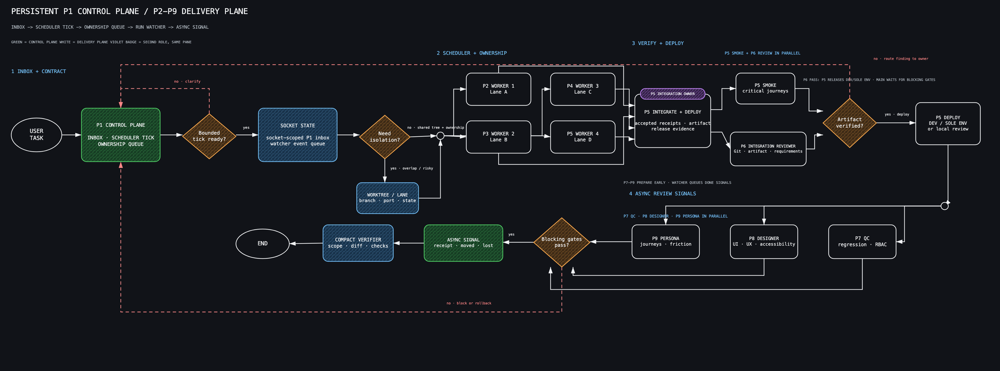

# Delivery flow reference

`assets/delivery-flow.excalidraw` is the editable semantic topology. SVG is the
canonical render source; PNG is its deterministic visual preview.



- [SVG version](../assets/delivery-flow.svg)
- [Editable Excalidraw version](../assets/delivery-flow.excalidraw)

Call `view_image` on the PNG before planning. Use SVG only as a fallback.

The graph shows two distinct planes: a persistent P1 control plane and the
P2-P9 delivery plane. It is the maximum standard-gate topology, not
unconditional concurrency. An approved compact local task may stop after ready
workers plus a read-only Compact verifier; it does not start P5-P9.
P2-P4 may already exist as idle reusable agents. Leasing them changes runtime
state, not this role topology; each active lease is still bound to one current
contract, generation, pane, session, root, and owned scope.

P1 owns the socket-scoped P1 inbox, bounded scheduler tick, ownership queue,
watcher event queue, and async signals. P1 does not implement, test, integrate,
review, commit, push, deploy, or long-wait on receipts.

For the standard gate:

- P2-P4 and a definitely-applicable fresh P5 start at the same fan-out boundary.
- P5 may prepare only integration-owned RED tests, fixtures, and scaffold while
  worker receipts are pending; accepting or publishing worker bytes still waits
  for validator-clean current receipts.
- An existing P5 Worker 4 restarts as Integration Owner before publishing.
- P5 smoke and P6 Integration Review run in parallel.
- Their PASS receipts release DEV or the sole environment; without a deployment
  target, P5 starts a local review runtime.
- P7-P9 prepare early, then run applicable review concurrently and report to P1
  as each finishes.
- Main promotion is performed by P5 after applicable blocking gates pass.

Before delivery or after a visual edit, regenerate PNG and run:

```bash
python3 scripts/render_assets.py --write assets/delivery-flow.png
python3 scripts/verify_assets.py
```

Update Excalidraw and SVG together. The validator enforces canonical elements,
node order, bound arrows, role colors, pinned renderer, and exact-byte PNG.
Update `assets/manifest.json` and pinned source digests in the same change.
